<div align="center">


# Tack

**A free, realtime, keyboard-first task manager.**

Issues, boards, sprints, projects and docs that update the moment anyone changes
anything. The polish you expect from a paid task manager, with no per-seat bill
at the end of the month.

**No pricing. No billing. No paid tiers. Not now, not later.**

[](https://github.com/Thefirstmannnn/tack/actions/workflows/ci.yml)
[](https://github.com/Thefirstmannnn/tack/releases/latest)
[](LICENSE)
[](https://github.com/Thefirstmannnn/tack/stargazers)
[](https://github.com/Thefirstmannnn/tack/commits/main)
[](https://github.com/Thefirstmannnn/tack/commits/main)

[](https://github.com/Thefirstmannnn/tack/labels/good%20first%20issue)
[](CONTRIBUTING.md)
[](https://bun.sh)
[](https://YOUR_DOMAIN)

[**Live demo**](https://YOUR_DOMAIN) · [**Documentation**](https://Thefirstmannnn.github.io/tack/) · [**Quick start**](#quick-start) · [**Releases**](https://github.com/Thefirstmannnn/tack/releases) · [**Changelog**](CHANGELOG.md) · [**Self-host**](docs/self-hosting.md) · [**Contribute**](CONTRIBUTING.md)

</div>

> **Self-hosting status: Preview.** The repository supports local evaluation,
> but it is not yet a supported production release. Review the current
> limitations in [the readiness tracker](docs/open-source-readiness.md).

<div align="center">
  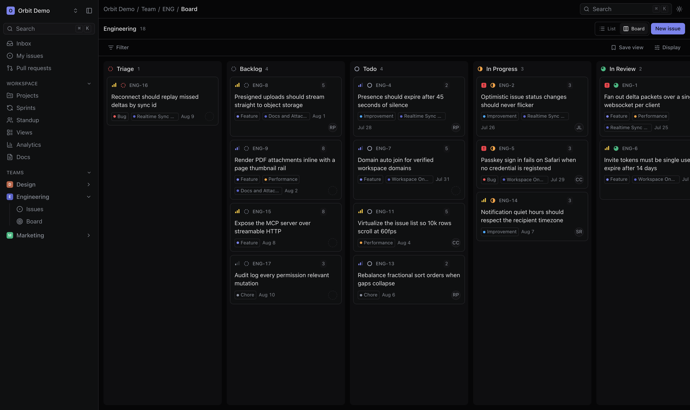
</div>

---

## Latest source release

**2026.09.08** adds similar-issue suggestions during creation, a workspace
project updates feed, and comment moderation for members and admins. It also
updates dependencies, preview deployment controls, documentation, and screenshots.

Read the [full changelog](CHANGELOG.md) and
[upgrade guide](docs/releases.md) before updating an existing installation.
Releases use dated source tags; self-hosting remains Preview.

## Why Tack exists

A task manager costs around 18 dollars per person per month. For a team of
twenty that is over four thousand dollars a year to keep a list of tasks in
order.

The alternatives were not a real answer. The free ones are slow and feel like
filling in a form. The self-hosted ones are heavy to run. The cheap ones are
cheap for a reason, and every one of them eventually asks for a card.

So we built the task manager we wanted, made it free and open-sourced it. Not free-with-an-asterisk,
not free-for-three-users, not free-until-we-raise. There is no billing code in
this repository and there is no plan to add any.

Tack is sponsored by [mbhatt](https://YOUR_DOMAIN), who pay for the hosted
instance and the engineering time. Everything is Apache-2.0, so you can run it
yourself and never depend on us at all.

## Screenshots

<table>
<tr>
<td width="50%">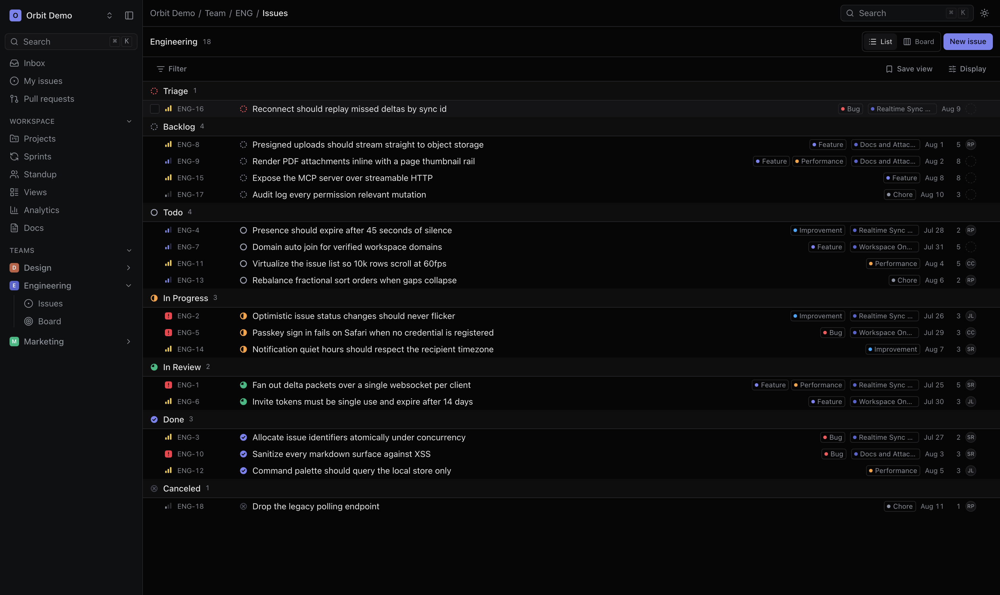<br /><sub><b>Issues</b>, as a fast list or a board. Every property changes from the keyboard.</sub></td>
<td width="50%">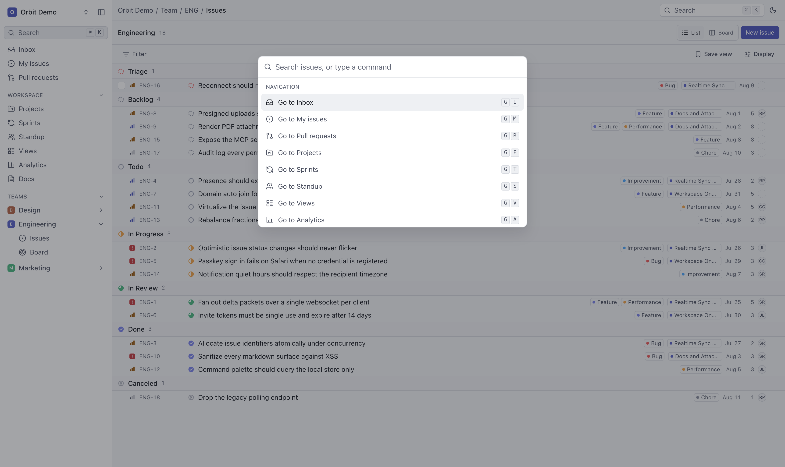<br /><sub><b>Command palette.</b> Cmd K, then go anywhere or do anything.</sub></td>
</tr>
<tr>
<td width="50%">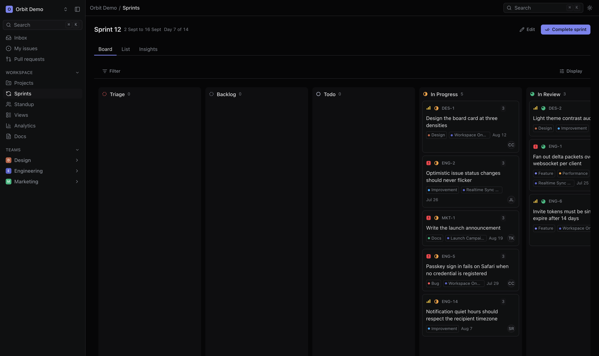<br /><sub><b>Sprints</b> with scope, points, burndown and carryover.</sub></td>
<td width="50%">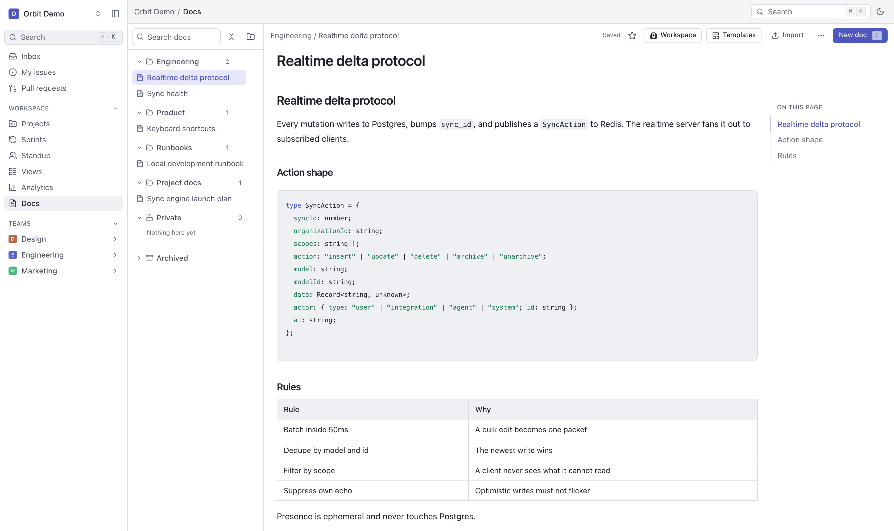<br /><sub><b>Docs</b> with a rich editor, living beside the issues they describe.</sub></td>
</tr>
<tr>
<td width="50%">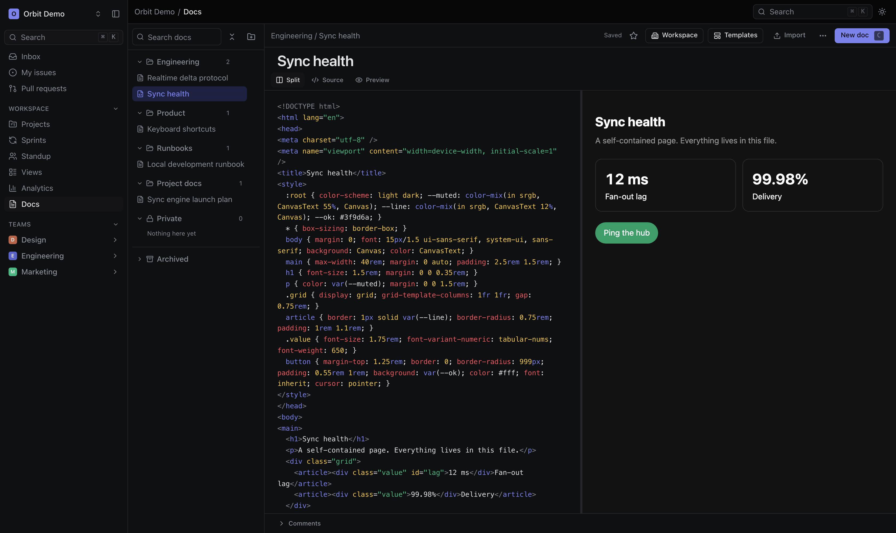<br /><sub><b>HTML pages</b> as one self-contained file, with a live preview and their own URL.</sub></td>
<td width="50%">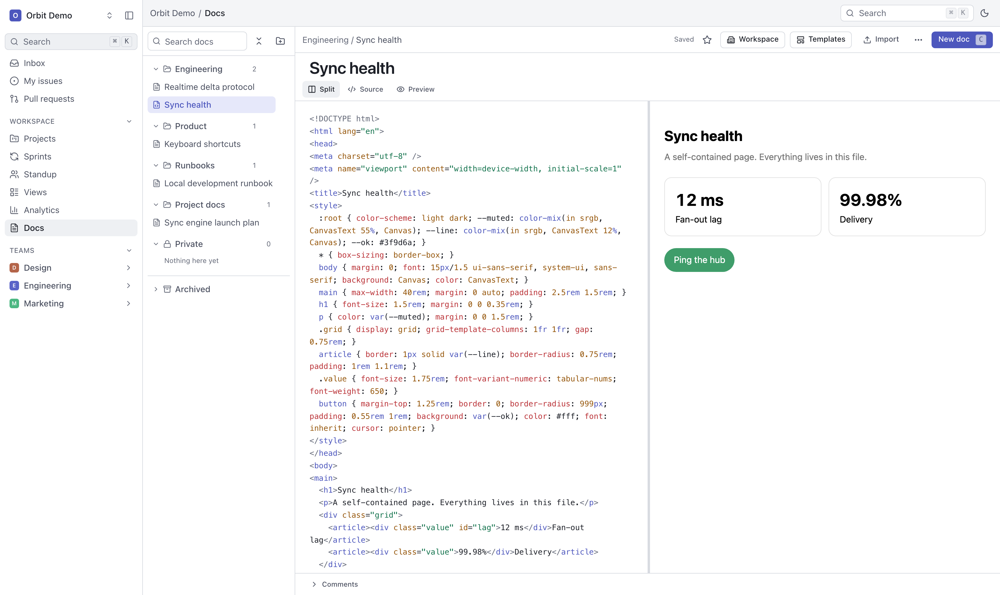<br /><sub>Source, split, or preview. CSS and script stay in the file.</sub></td>
</tr>
<tr>
<td width="50%">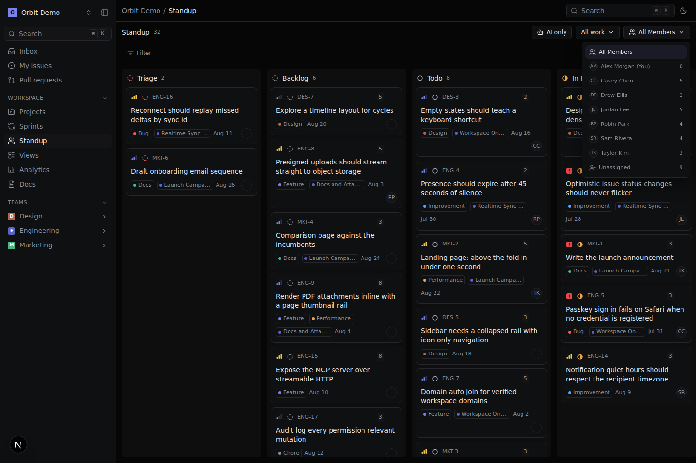<br /><sub><b>Standup</b>: the whole workspace as a Kanban, filtered to one person with a click.</sub></td>
<td width="50%">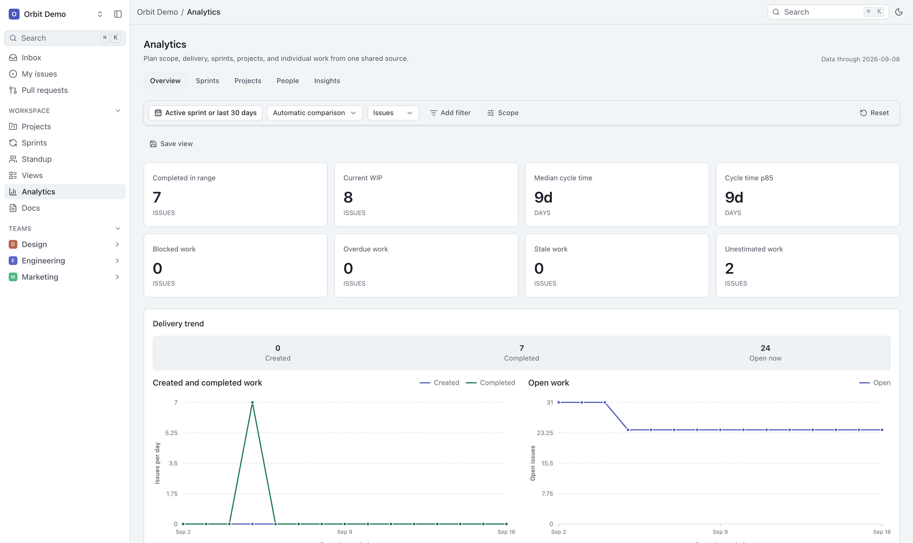<br /><sub><b>Analytics</b>: scope, throughput, churn and distributions.</sub></td>
</tr>
<tr>
<td width="50%">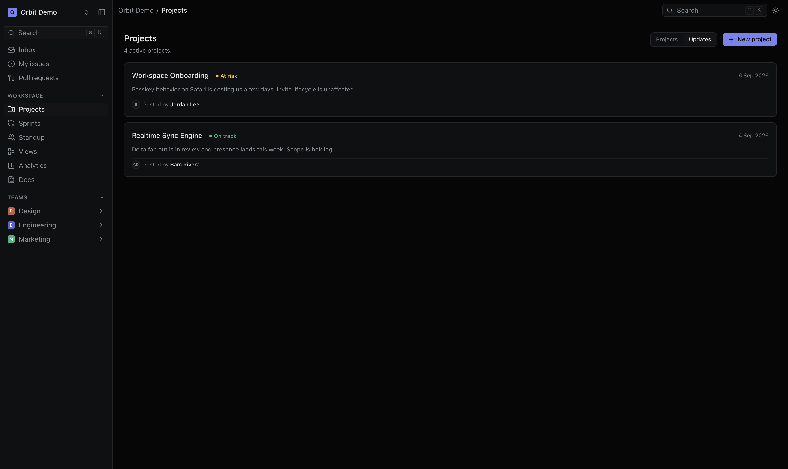<br /><sub><b>Project updates</b>: health reports from across the workspace in one feed.</sub></td>
<td width="50%">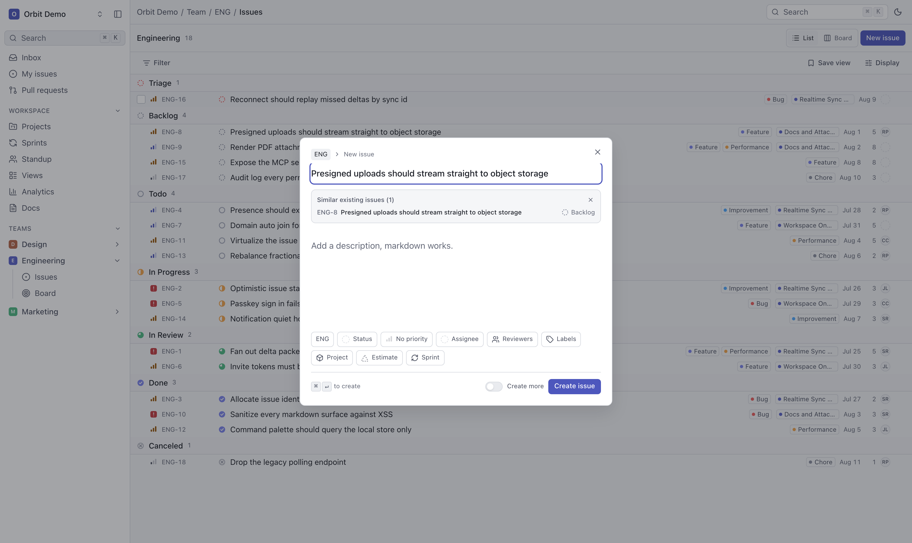<br /><sub><b>Similar issues</b>: review an existing task before creating another.</sub></td>
</tr>
</table>

<sub>More in [`docs/assets/screenshots`](docs/assets/screenshots), every screen in both themes.</sub>

## What it does

| | |
| --- | --- |
| **Issues** | Priorities, labels, states, estimates, assignees, multiple reviewers and relations. Similar-issue suggestions during creation. Fast list or keyboard-accessible drag-and-drop board |
| **Sprints and cycles** | Timeboxed planning with scope, points, burndown and carryover |
| **Projects and milestones** | Group work across teams and sprints, track health, and read workspace project updates |
| **Docs** | Rich editor, collections, comments, public share links, self-contained HTML pages |
| **Standup** | The whole workspace as a Kanban, filtered to work a person owns or reviews by clicking their tile |
| **Analytics** | Scope, throughput, churn, and distribution by assignee, project, label and estimate |
| **Search and views** | Filters over everything, saved and shared or kept private |
| **Realtime** | Every change fans out over a websocket to exactly the people allowed to see it |
| **Keyboard first** | Cmd K for everything, `g` to navigate, single keys to act. Press `?` |
| **MCP server** | AI agents read the board and file work, with your permissions, over OAuth |
| **Notifications** | In-app inbox, with per-event preferences and quiet hours |
| **Slack (gated)** | Personal notification DMs, mapped-channel issue unfurls, and member sync after an operator completes the [Slack rollout](docs/integrations.md#launch-order) |
| **GitHub** | Pull requests linked to the issues they close |
| **Auth** | Passkeys, Google, GitHub, email OTP. Password optional and off by default |
| **Roles** | Admin, member, contributor and guest, enforced on the server |
| **Themes** | Light and dark, both first class |

## Quick start

You need [Bun](https://bun.sh) 1.3 or newer and Docker. That is the whole list.

```bash
git clone https://github.com/Thefirstmannnn/tack.git
cd tack

bun install
cp .env.example .env

bun run infra:up        # postgres, redis and minio
bun run db:push         # create the schema
bun run db:test-setup   # create the test databases
bun run db:seed         # load a demo workspace

bun run dev             # http://localhost:3000
```

Sign in as **`alex@tack.example`**. The seed loads three teams, seven people,
thirty two issues, projects, sprints and docs, so there is something to click on
straight away.

Then press <kbd>Cmd</kbd> <kbd>K</kbd>, and open a second tab and change
something in one to watch the other update.

| Service | Port |
| --- | --- |
| web | 3000 |
| realtime (development only) | 3100 |
| postgres | 5434 |
| redis | 6380 |
| minio | 9010 |

Full walkthrough in [docs/getting-started.md](docs/getting-started.md).

## Reference deployment (Preview)

The setup below describes the mbhatt deployment profile. It is not a
provider-neutral production support commitment.

Tack is one Next.js app. It needs Postgres, Redis and an S3-compatible bucket,
all of which have free tiers, so a small team can run it for nothing.

[](https://vercel.com/new/clone?repository-url=https%3A%2F%2Fgithub.com%2Fmbhatt%2Ftack&root-directory=apps%2Fweb&env=DATABASE_URL,REDIS_URL,BETTER_AUTH_SECRET,BETTER_AUTH_URL,NEXT_PUBLIC_APP_URL,RESEND_API_KEY,EMAIL_FROM&project-name=tack&repository-name=tack)

The button prompts for Resend so a fresh deployment can send sign-in codes. You
can instead configure password, Google or GitHub sign-in. Production refuses to
build or start without one complete method; see [Authentication](docs/configuration.md#authentication).

Two things that are not optional and produce confusing failures if you get them
wrong:

- **Root directory is `apps/web`, and functions run on node.** Do not set
  `bunVersion` in `apps/web/vercel.json`. It moves every function to the Bun
  runtime, where the websocket upgrade at `/api/ws` silently never happens and
  the browser retries forever against a socket that never opens.
- **Never set `NEXT_PUBLIC_REALTIME_URL` in production.** The socket is served
  from the page's own origin, and Tack ignores this variable in production.
  Leaving it set only makes the deployment configuration misleading.

Supabase for Postgres, Upstash for Redis, Cloudflare R2 for files and Resend for
email is the combination we run. Other providers have not yet been certified by
this project.

Full guide, including running it on your own server behind nginx:
[docs/self-hosting.md](docs/self-hosting.md).

## For AI agents

Tack ships an MCP server, so Claude, Cursor, VS Code or anything else that
speaks MCP can read your board and do work in it.

```bash
claude mcp add --transport http tack https://tack.example.com/mcp
```

OAuth only, no API keys. You pick the workspace, re-verify a passkey and approve
the scopes, and the grant is revocable from settings. **An agent never has more
permission than the person who authorised it**, because the tools run through
the same policy as everything else. A token with only `tack.read` is not shown
the write tools at all.

Sixty odd tools covering issues, sprints, projects and docs. Things that work
today:

> "What is blocking the Realtime Sync Engine project?"
>
> "File a bug on Engineering: passkey sign-in fails on Safari when no credential
> is registered. High priority, assign it to me."
>
> "Summarise what each person closed yesterday."

[docs/mcp.md](docs/mcp.md) has the setup and the full tool list.

## Documentation

| | |
| --- | --- |
| [Getting started](docs/getting-started.md) | Run it locally in five minutes |
| [Concepts](docs/concepts.md) | Workspaces, teams, issues, sprints, projects, docs, views |
| [Self-hosting](docs/self-hosting.md) | Vercel, Supabase, Upstash, R2, or your own server |
| [Configuration](docs/configuration.md) | Every environment variable |
| [Keyboard shortcuts](docs/keyboard-shortcuts.md) | All of them |
| [MCP server](docs/mcp.md) | Connect an AI assistant |
| [Integrations](docs/integrations.md) | GitHub and gated Slack setup |
| [Changelog](CHANGELOG.md) | Features, fixes and upgrade notes for every source release |
| [Releases and upgrades](docs/releases.md) | Versioning, publishing, deployment checks and rollback |
| [Architecture](docs/architecture.md) | How a change reaches every screen |
| [Testing](docs/testing.md) | Running and writing tests |
| [Troubleshooting](docs/troubleshooting.md) | The failures we actually hit |
| [Roadmap](docs/roadmap.md) | What is next, and what we will not do |

## How it is built

```
apps/web                  Next.js 16: UI, REST handlers, auth, /api/ws, /mcp
apps/realtime             Websocket host, local development only, never deployed
packages/realtime-server  Connection hub: tickets, scopes, presence, Redis fan-out
packages/realtime-client  Browser client: subscribe, patch, reconnect
packages/mcp-server       MCP tools and the handler behind /mcp
packages/core             Domain operations shared by REST, MCP and the hub
packages/services         Markdown, storage, email, notifications, Slack, GitHub
packages/db               Drizzle schema, migrations, client, seed
packages/shared           Zod validators, domain types, event contracts, policy
```

TypeScript throughout, in strict mode with `any` as a lint error. Next.js 16 and
React 19. Postgres through Drizzle. Redis for realtime fan-out. Bun as the
toolchain, node as the runtime, because a Vercel function can only upgrade a
websocket on node.

A change writes to Postgres, bumps a monotonic `sync_id`, publishes to Redis,
and the hub fans it out to the connections whose scope entitles them to see it.
The client patches its cache rather than refetching, so your scroll position and
selection survive. [docs/architecture.md](docs/architecture.md) has the detail.

## Contributing

Contributions are wanted, and not only code. Docs, bug reports, translations,
accessibility and design all count.

```bash
bun run verify   # lint, comment policy, types, tests. The same four CI runs
```

Good places to start:

- [**Good first issues**](https://github.com/Thefirstmannnn/tack/labels/good%20first%20issue), scoped small with the file paths written into the description
- [**Help wanted**](https://github.com/Thefirstmannnn/tack/labels/help%20wanted), everything we would like a hand with
- [**The roadmap**](docs/roadmap.md), for the bigger pieces

A few house rules that will otherwise surprise you in review: **Bun only**, no
npm or pnpm. **No comments in code**, the build fails on them, so put the
meaning in names and the prose in the pull request. **No `any`**, no non-null
assertions. **No em-dashes.** And a feature is not done until it has a test that
would fail if the feature broke.

Full guide in [CONTRIBUTING.md](CONTRIBUTING.md). The repository carries its own
context files, [`CLAUDE.md`](CLAUDE.md) and [`AGENTS.md`](AGENTS.md), so your
editor picks up the conventions without you explaining them each time.

## Community

- [**Discussions**](https://github.com/Thefirstmannnn/tack/discussions) for questions and ideas
- [**Issues**](https://github.com/Thefirstmannnn/tack/issues) for bugs and concrete work
- [**Security**](SECURITY.md) for anything that should not be public

If Tack is useful to you, a star helps other people find it.

## Sponsor

<div align="center">
  <a href="https://YOUR_DOMAIN">
    <b>Sponsored by mbhatt</b>
  </a>
</div>

[mbhatt](https://YOUR_DOMAIN) builds evaluation and observability tooling for AI
systems, and pays for Tack's hosting and engineering time. Tack is not a
funnel for it. There is no upsell, no "contact sales" and no gated feature. We
needed a task manager, we could not find a free one that was good, so we built one
and gave it away.

## License

[Apache License 2.0](LICENSE). Use it, run it, change it, ship it, commercially
or otherwise. The patent grant protects you, and the [NOTICE](NOTICE) asks only
that a public fork picks its own name so nobody confuses your build with this
one.

<div align="center">
<sub>Built by <a href="https://YOUR_DOMAIN">mbhatt</a>.</sub>
</div>
